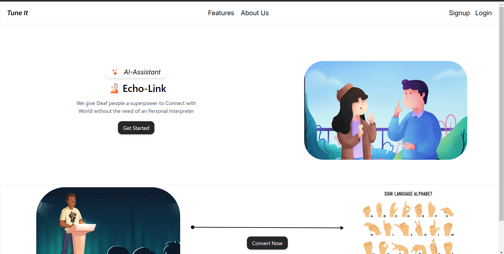
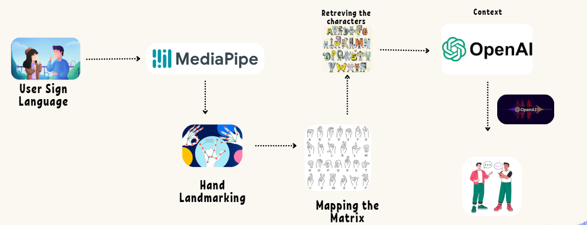

## 🧏🏻"Echo-Link"(Assistant for Deaf People)

 Echo-Link a platform which bridges Communication Gap between the Deaf people and Others without the need of an Interpreter or a need to have the Knowledge of the Sign Language for the Opposite people and vice versa where deaf people can get corresponding sign images when a speaker sends a recorded audio.

 ## 🌟Features of the App
 - Converts SignLanguage to Speech with Help of LLM
 - Converts Speech to Sign Language representing corresponding images
 - The User can give context before, what are they trying to convey.

## 📚 Project Tech Stack

- **Azure**: Cloud hosting, storage, and deployment.  
- **React**: Frontend framework for building UI.  
- **JavaScript**: Core language for frontend logic.  
- **Python**: Backend development and server-side logic.  

 ## Work-flow of the App🎯
 

### For Sign Language to Speech Conversion:
 - **MediaPipe** - For 🤚Hand LandMark Anotations
 - **SignLanguage Matrix** - Getting Markings for the true values of Language
 - **Azure OpenAi (GPT4o)** - For giving context and passing corresponding characters
 - **Azure Speech Service** - Converts all the LLM context into Speech🔊

### For Speech to Sign Language Conversion:
 - **SpeechRecognition Library** - For converting the speech into text
 - **Mapping** - Mapping of text to sign language
 - **Azure Blob Storage** - For storing the data
 - **Azure App Service** - For deploying the server(backend)
 - **Vercel** - Frontend hosting and deployment platform

 
